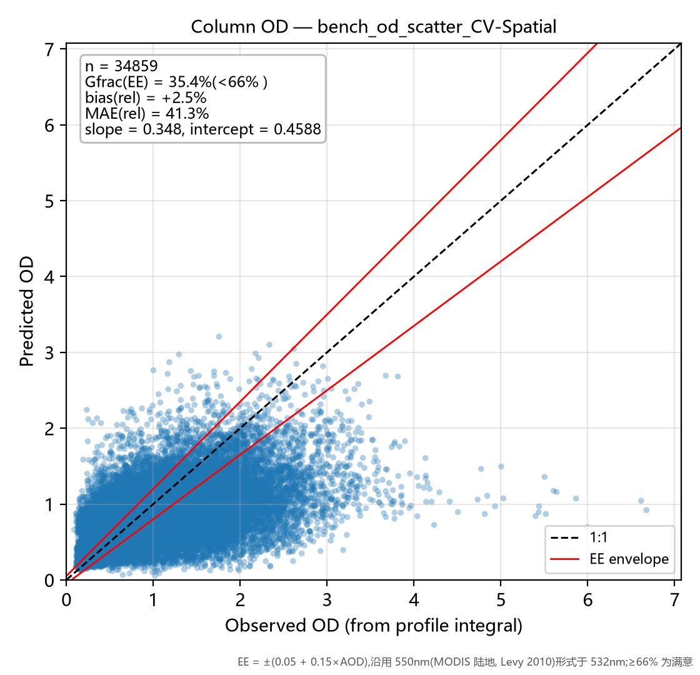
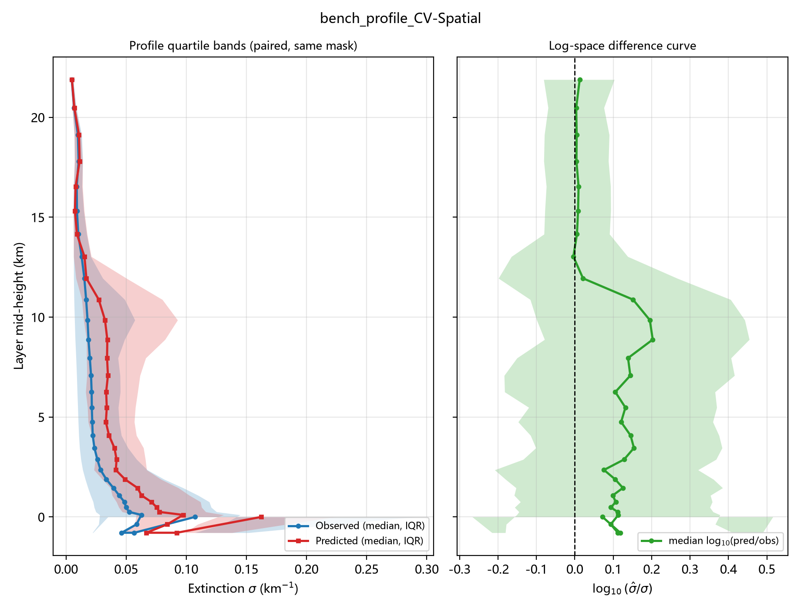
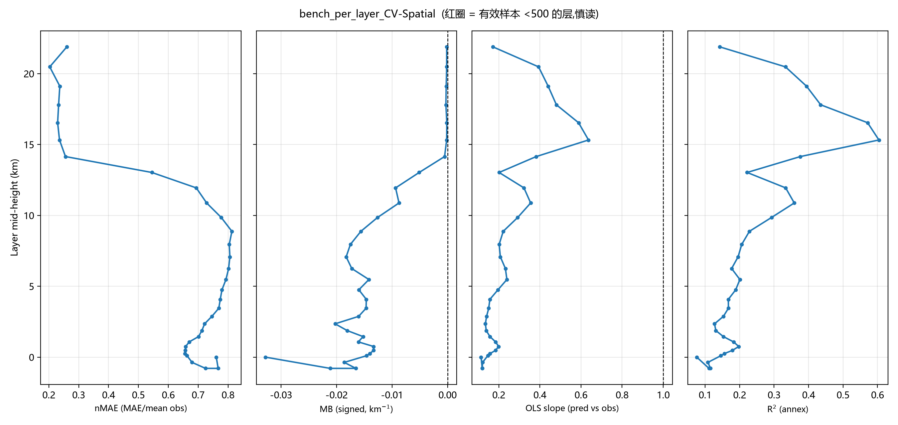

# 评估台报告 — CV-Spatial

- 运行目录:`结果汇总\runs\train_agl_b0_cv` | 标签:`Spatial_CV` | N_test = 34,859 | 生成于 2026-09-29 18:38
- 配置:target=abs  w_profile=none  log_target=False  softplus=False  tag=CV
- 指标定义与计算方式:[指标说明](../../../指标说明.md)(MAE/nMAE/MB/slope/OD/Gfrac EE/log10 比值/分带规则)

## 一句话结论

> **低层(0–5km 三带平均) MAE = 0.0618 km⁻¹(0–1km 带 0.0814,nMAE 69.2%,
> n=213,644);柱含量 OD 相对误差 bias = +2.5%,|rel| MAE = 41.3%,
> Gfrac(EE) = 35.4%(未达 66% 满意线);
> OD slope = 0.348 / intercept = 0.4588;GCF(n=19573) R² = 0.472,
> MAE = 0.0883。全局 R² = 0.2704(附图口径)。**

## 图 1|柱含量 OD 散点 + EE 包络

**看什么**:点云贴 1:1 虚线的程度 = 柱含量保真能力;红线为 EE 包络 ±(0.05+0.15×AOD)(550nm 形式用于 532nm),
包络内比例 Gfrac = **35.4%**(低于 66% 满意线)。
slope = 0.348 < 1 且 intercept = 0.4588 > 0 → 干净样本略抬、污染样本压扁(动态范围压缩);
bias = +2.5% 说明总量基本无偏。

## 图 2|廓线分位带 + 对数差值曲线

**看什么**:左栏蓝/红 = 观测/预测的逐层中位数与 25–75 分位带(同批样本同掩膜配对)——
红带比蓝带"瘦"即动态范围压缩;右栏 log10(σ̂/σ) 中位线在 0 上下 = 典型样本无系统偏差,
若中位线偏正而均值偏置为负,则是**高消光尾部被低估**的形态(基线 B0 低层即如此)。

## 图 3|逐层 nMAE / MB / slope / R² 四联

**看什么**(自左至右):nMAE 跨层可比的主指标;MB 带符号偏置(偏离 0 的方向 = 总量型误差);
slope 相对 1 的偏离 = 压缩程度(此栏是基线病灶最直观的面板);R² 仅附图(分母为观测方差,跨层不可比)。
红圈层有效样本 <500,数字慎读。

## 分层带表

| 带 | 层均样本 n_obs | MAE (km⁻¹) | nMAE | MB | slope |
|----|--------------|-----------|------|-----|-------|
| 0-1km | 213,644 | 0.0814 | 69.2% | -0.0174 | 0.145 |
| 1-3km | 152,808 | 0.0553 | 71.1% | -0.0171 | 0.151 |
| 3-5km | 98,393 | 0.0487 | 77.4% | -0.0151 | 0.168 |
| 5-10km | 205,551 | 0.0563 | 79.9% | -0.0159 | 0.233 |
| >10km | 348,579 | 0.0109 | 36.2% | -0.0025 | 0.397 |

> 机器可读明细:`bench_CV-Spatial.json`(含逐层 32 行)/ `bench_CV-Spatial.csv`。
