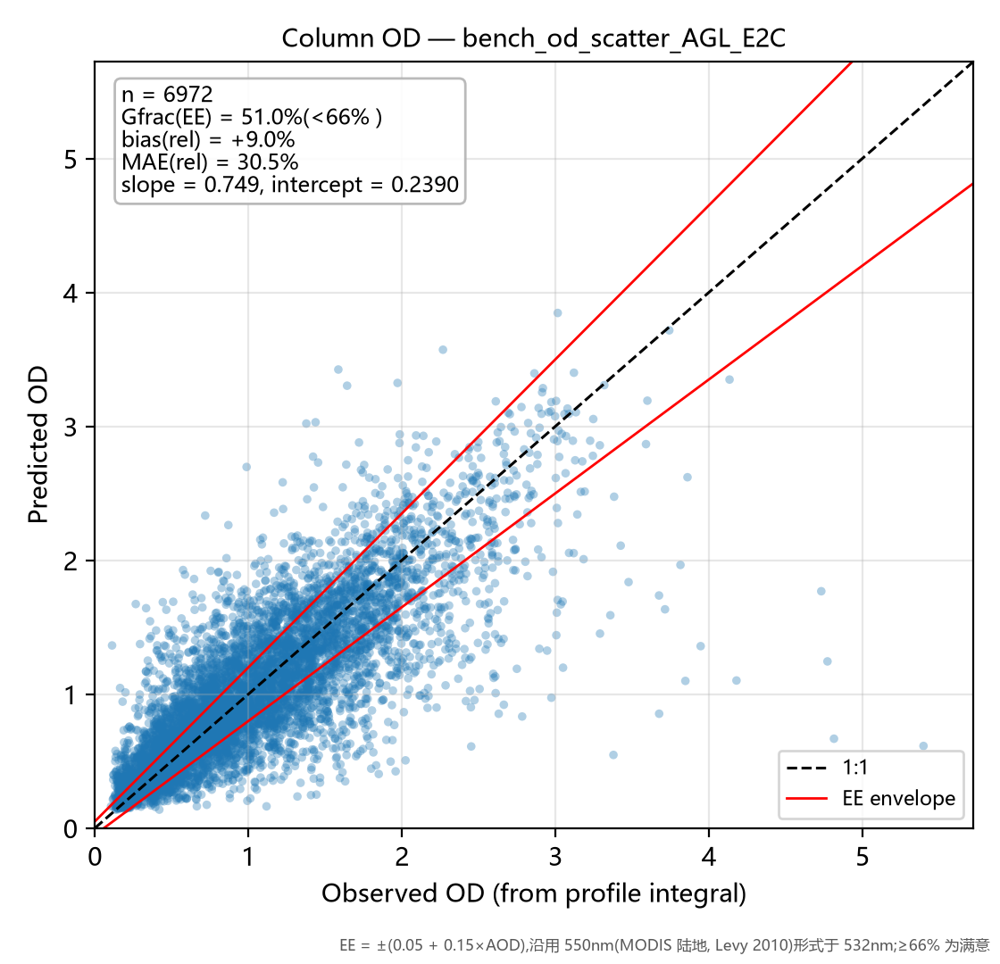
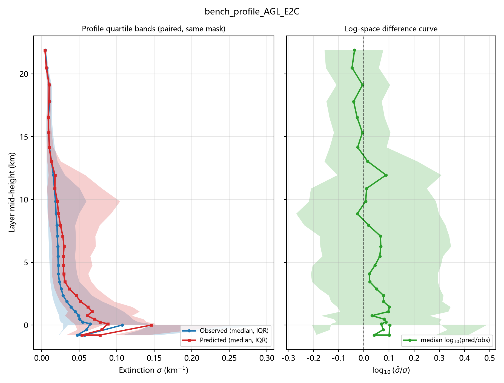
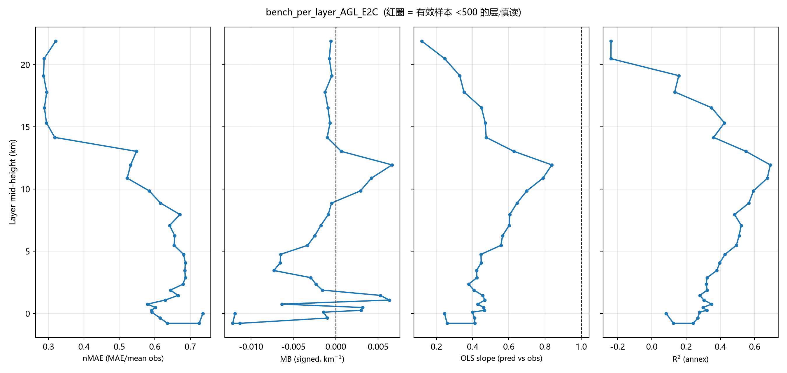

# 评估台报告 — AGL_E2C

- 运行目录:`结果汇总\runs\train_agl_e2c` | 标签:`Holdout_AGL_E2C` | N_test = 6,972 | 生成于 2026-10-03 16:04
- 配置:target=abs  w_profile=none  log_target=False  softplus=True  tag=AGL_E2C
- 指标定义与计算方式:[指标说明](../../../指标说明.md)(MAE/nMAE/MB/slope/OD/Gfrac EE/log10 比值/分带规则)

## 一句话结论

> **低层(0–5km 三带平均) MAE = 0.0567 km⁻¹(0–1km 带 0.0759,nMAE 62.9%,
> n=42,567);柱含量 OD 相对误差 bias = +9.0%,|rel| MAE = 30.5%,
> Gfrac(EE) = 51.0%(未达 66% 满意线);
> OD slope = 0.749 / intercept = 0.2390;GCF(n=3903) R² = 0.542,
> MAE = 0.0791。全局 R² = 0.4468(附图口径)。**

## 图 1|柱含量 OD 散点 + EE 包络

**看什么**:点云贴 1:1 虚线的程度 = 柱含量保真能力;红线为 EE 包络 ±(0.05+0.15×AOD)(550nm 形式用于 532nm),
包络内比例 Gfrac = **51.0%**(低于 66% 满意线)。
slope = 0.749 < 1 且 intercept = 0.2390 > 0 → 干净样本略抬、污染样本压扁(动态范围压缩);
bias = +9.0% 说明总量存在系统性偏移。

## 图 2|廓线分位带 + 对数差值曲线

**看什么**:左栏蓝/红 = 观测/预测的逐层中位数与 25–75 分位带(同批样本同掩膜配对)——
红带比蓝带"瘦"即动态范围压缩;右栏 log10(σ̂/σ) 中位线在 0 上下 = 典型样本无系统偏差,
若中位线偏正而均值偏置为负,则是**高消光尾部被低估**的形态(基线 B0 低层即如此)。

## 图 3|逐层 nMAE / MB / slope / R² 四联

**看什么**(自左至右):nMAE 跨层可比的主指标;MB 带符号偏置(偏离 0 的方向 = 总量型误差);
slope 相对 1 的偏离 = 压缩程度(此栏是基线病灶最直观的面板);R² 仅附图(分母为观测方差,跨层不可比)。
红圈层有效样本 <500,数字慎读。

## 分层带表

| 带 | 层均样本 n_obs | MAE (km⁻¹) | nMAE | MB | slope |
|----|--------------|-----------|------|-----|-------|
| 0-1km | 42,567 | 0.0759 | 62.9% | -0.0044 | 0.385 |
| 1-3km | 30,432 | 0.0512 | 66.1% | +0.0008 | 0.427 |
| 3-5km | 19,609 | 0.0432 | 68.4% | -0.0068 | 0.439 |
| 5-10km | 41,097 | 0.0455 | 63.7% | -0.0010 | 0.612 |
| >10km | 69,720 | 0.0094 | 36.9% | +0.0006 | 0.470 |

> 机器可读明细:`bench_AGL_E2C.json`(含逐层 32 行)/ `bench_AGL_E2C.csv`。
