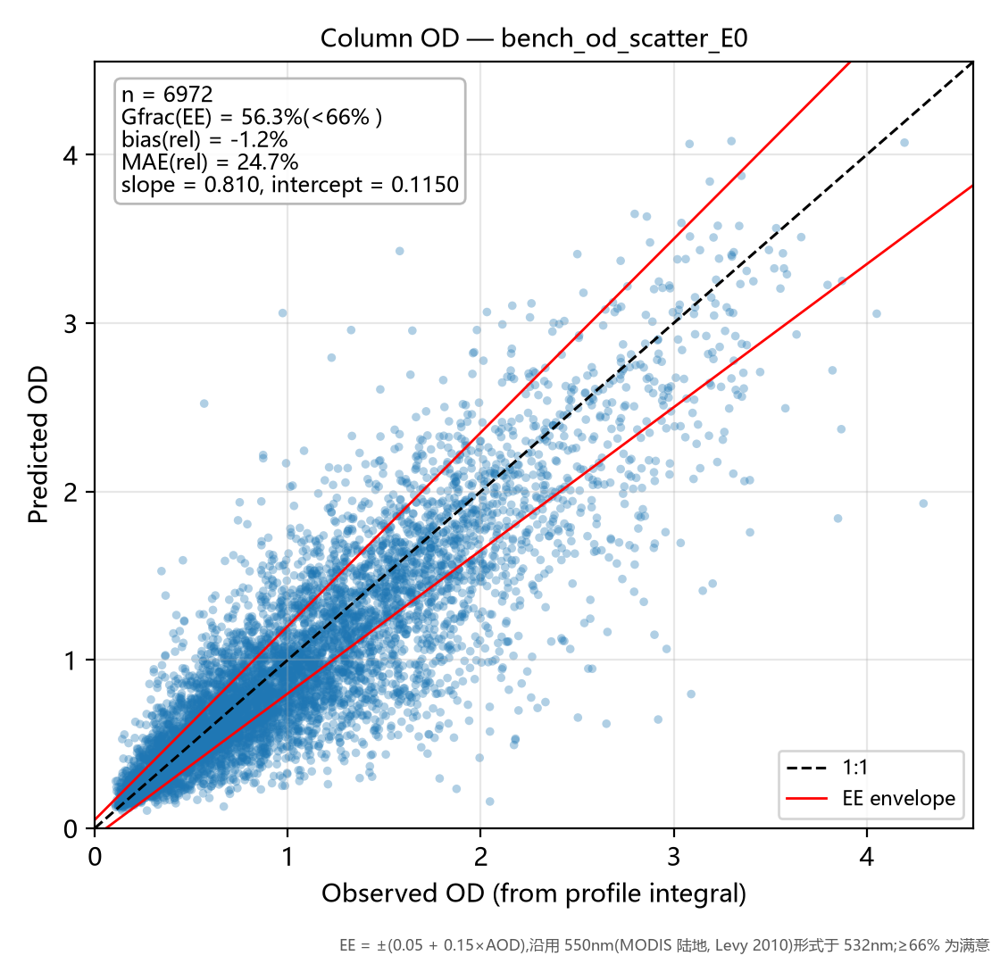
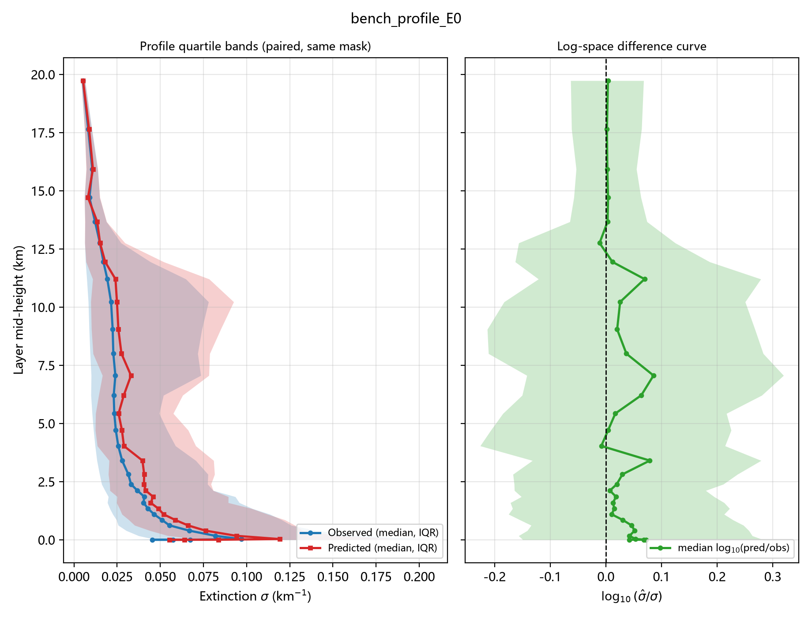
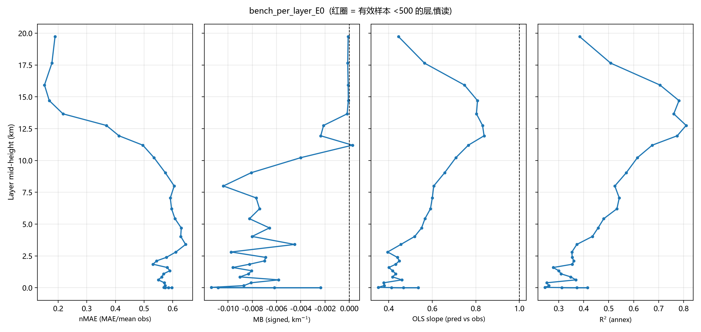

# 评估台报告 — E0

- 运行目录:`结果汇总\runs\train_exp_E0` | 标签:`Holdout_E0` | N_test = 6,972 | 生成于 2026-09-28 19:11
- 配置:target=abs  w_profile=none  log_target=False  softplus=False  tag=E0
- 指标定义与计算方式:[指标说明](../../../指标说明.md)(MAE/nMAE/MB/slope/OD/Gfrac EE/log10 比值/分带规则)

## 一句话结论

> **低层(0–5km 三带平均) MAE = 0.0531 km⁻¹(0–1km 带 0.0672,nMAE 57.0%,
> n=29,680);柱含量 OD 相对误差 bias = -1.2%,|rel| MAE = 24.7%,
> Gfrac(EE) = 56.3%(未达 66% 满意线);
> OD slope = 0.810 / intercept = 0.1150;GCF(n=2079) R² = 0.423,
> MAE = 0.0421。全局 R² = 0.4966(附图口径)。**

## 图 1|柱含量 OD 散点 + EE 包络

**看什么**:点云贴 1:1 虚线的程度 = 柱含量保真能力;红线为 EE 包络 ±(0.05+0.15×AOD)(550nm 形式用于 532nm),
包络内比例 Gfrac = **56.3%**(低于 66% 满意线)。
slope = 0.810 < 1 且 intercept = 0.1150 > 0 → 干净样本略抬、污染样本压扁(动态范围压缩);
bias = -1.2% 说明总量基本无偏。

## 图 2|廓线分位带 + 对数差值曲线

**看什么**:左栏蓝/红 = 观测/预测的逐层中位数与 25–75 分位带(同批样本同掩膜配对)——
红带比蓝带"瘦"即动态范围压缩;右栏 log10(σ̂/σ) 中位线在 0 上下 = 典型样本无系统偏差,
若中位线偏正而均值偏置为负,则是**高消光尾部被低估**的形态(基线 B0 低层即如此)。

## 图 3|逐层 nMAE / MB / slope / R² 四联

**看什么**(自左至右):nMAE 跨层可比的主指标;MB 带符号偏置(偏离 0 的方向 = 总量型误差);
slope 相对 1 的偏离 = 压缩程度(此栏是基线病灶最直观的面板);R² 仅附图(分母为观测方差,跨层不可比)。
红圈层有效样本 <500,数字慎读。

## 分层带表

| 带 | 层均样本 n_obs | MAE (km⁻¹) | nMAE | MB | slope |
|----|--------------|-----------|------|-----|-------|
| 0-1km | 29,680 | 0.0672 | 57.0% | -0.0078 | 0.425 |
| 1-3km | 37,719 | 0.0466 | 57.3% | -0.0083 | 0.423 |
| 3-5km | 19,437 | 0.0455 | 63.4% | -0.0064 | 0.508 |
| 5-10km | 34,164 | 0.0475 | 59.5% | -0.0084 | 0.604 |
| >10km | 62,730 | 0.0150 | 30.2% | -0.0010 | 0.723 |

> 机器可读明细:`bench_E0.json`(含逐层 32 行)/ `bench_E0.csv`。
