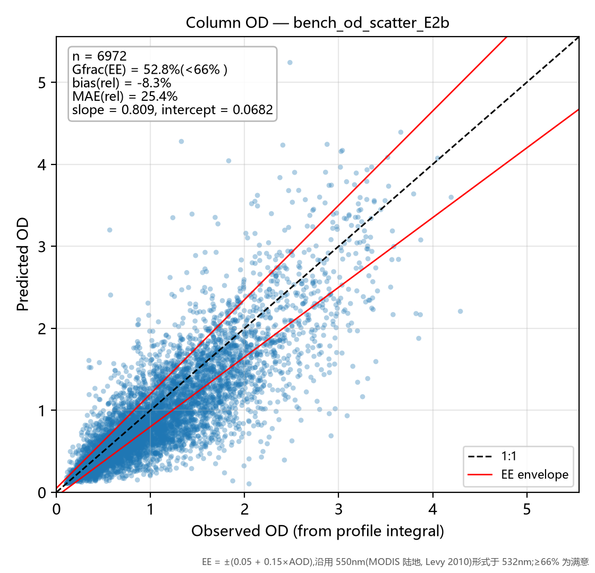
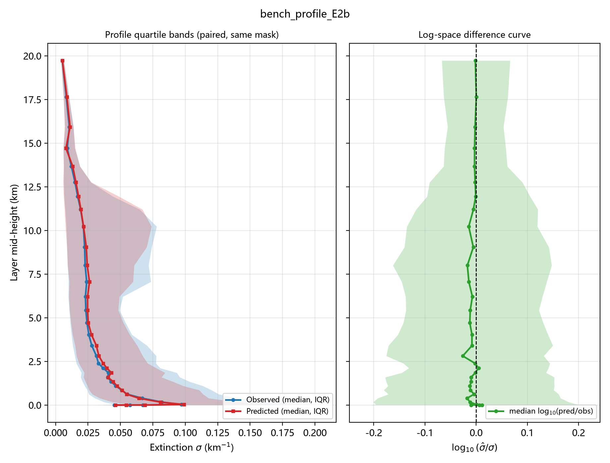
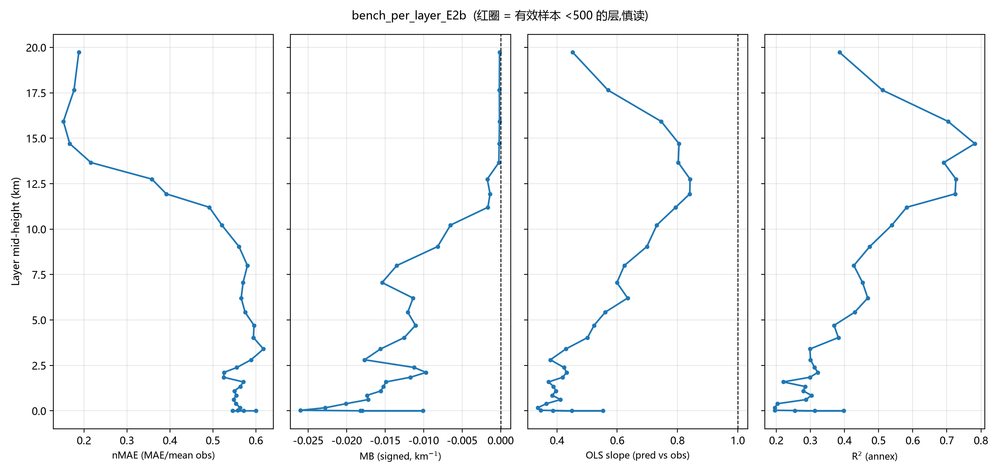

# 评估台报告 — E2b

- 运行目录:`结果汇总\runs\train_exp_E2b` | 标签:`Holdout_E2b` | N_test = 6,972 | 生成于 2026-09-28 19:11
- 配置:target=abs  w_profile=none  log_target=True  softplus=False  tag=E2b
- 指标定义与计算方式:[指标说明](../../../指标说明.md)(MAE/nMAE/MB/slope/OD/Gfrac EE/log10 比值/分带规则)

## 一句话结论

> **低层(0–5km 三带平均) MAE = 0.0515 km⁻¹(0–1km 带 0.0660,nMAE 55.9%,
> n=29,680);柱含量 OD 相对误差 bias = -8.3%,|rel| MAE = 25.4%,
> Gfrac(EE) = 52.8%(未达 66% 满意线);
> OD slope = 0.809 / intercept = 0.0682;GCF(n=2079) R² = 0.403,
> MAE = 0.0410。全局 R² = 0.4374(附图口径)。**

## 图 1|柱含量 OD 散点 + EE 包络

**看什么**:点云贴 1:1 虚线的程度 = 柱含量保真能力;红线为 EE 包络 ±(0.05+0.15×AOD)(550nm 形式用于 532nm),
包络内比例 Gfrac = **52.8%**(低于 66% 满意线)。
slope = 0.809 < 1 且 intercept = 0.0682 > 0 → 干净样本略抬、污染样本压扁(动态范围压缩);
bias = -8.3% 说明总量存在系统性偏移。

## 图 2|廓线分位带 + 对数差值曲线

**看什么**:左栏蓝/红 = 观测/预测的逐层中位数与 25–75 分位带(同批样本同掩膜配对)——
红带比蓝带"瘦"即动态范围压缩;右栏 log10(σ̂/σ) 中位线在 0 上下 = 典型样本无系统偏差,
若中位线偏正而均值偏置为负,则是**高消光尾部被低估**的形态(基线 B0 低层即如此)。

## 图 3|逐层 nMAE / MB / slope / R² 四联

**看什么**(自左至右):nMAE 跨层可比的主指标;MB 带符号偏置(偏离 0 的方向 = 总量型误差);
slope 相对 1 的偏离 = 压缩程度(此栏是基线病灶最直观的面板);R² 仅附图(分母为观测方差,跨层不可比)。
红圈层有效样本 <500,数字慎读。

## 分层带表

| 带 | 层均样本 n_obs | MAE (km⁻¹) | nMAE | MB | slope |
|----|--------------|-----------|------|-----|-------|
| 0-1km | 29,680 | 0.0660 | 55.9% | -0.0189 | 0.404 |
| 1-3km | 37,719 | 0.0452 | 55.5% | -0.0137 | 0.401 |
| 3-5km | 19,437 | 0.0433 | 60.2% | -0.0130 | 0.485 |
| 5-10km | 34,164 | 0.0455 | 57.0% | -0.0121 | 0.623 |
| >10km | 62,730 | 0.0146 | 29.6% | -0.0013 | 0.732 |

> 机器可读明细:`bench_E2b.json`(含逐层 32 行)/ `bench_E2b.csv`。
