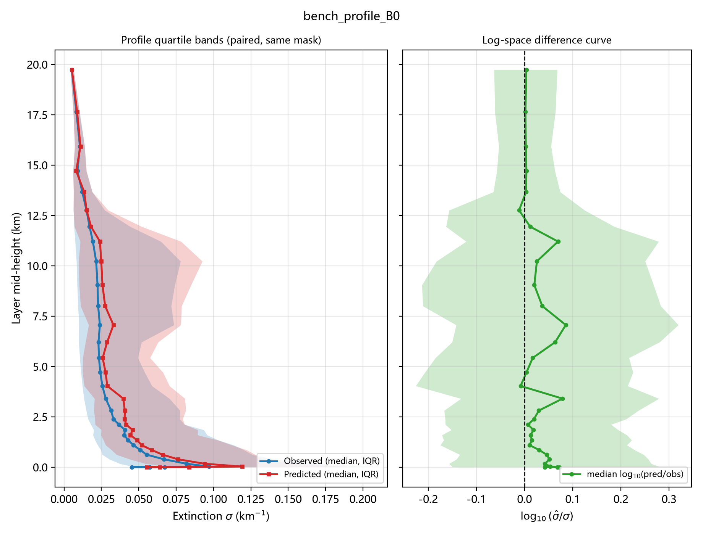
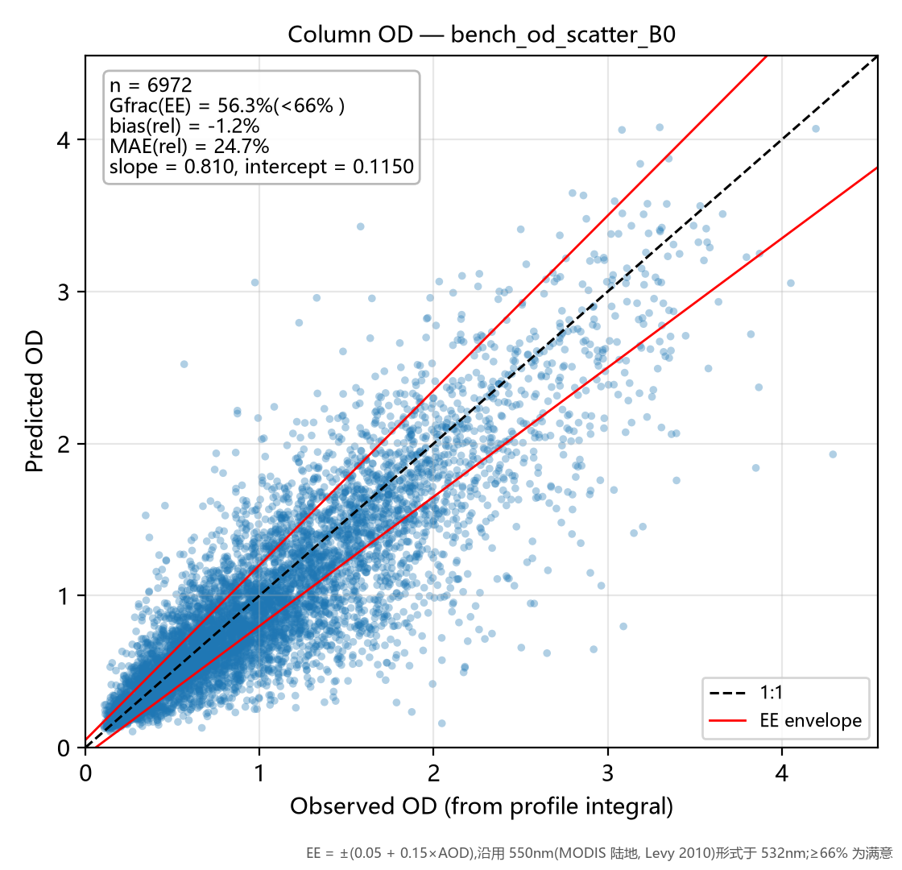
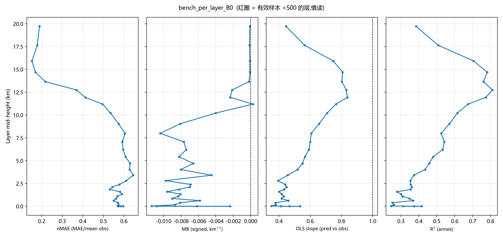
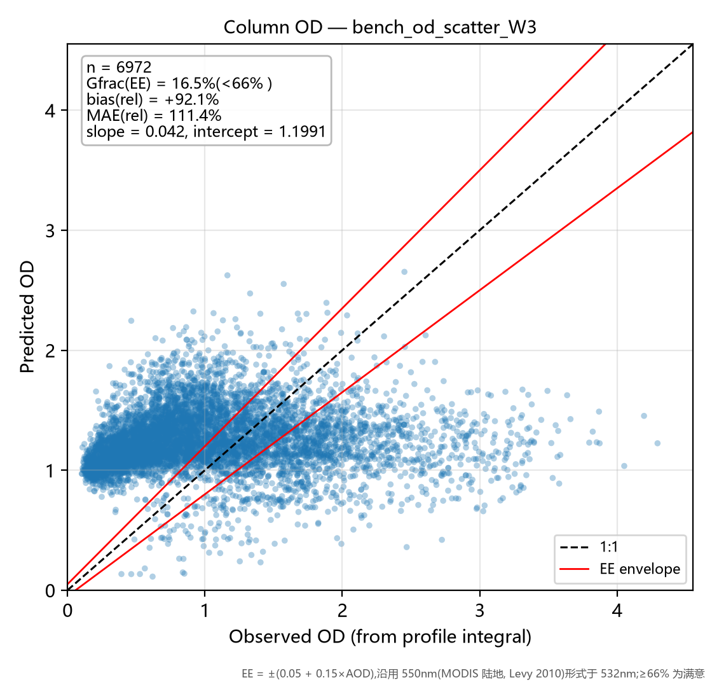
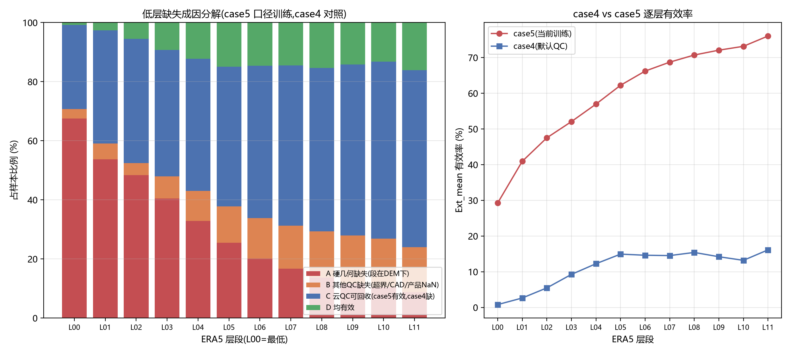

# 优化路线执行报告（Step 0–3）· 2026-09-28

依据《优化路线讨论.md》在 demo 分支完成 Step 0–3 全部实验。所有运行同一留出集
（seed=42，N_test=6,972，case5 匹配产物 34,860 样本），比较口径统一为评估台
`evaluate_bench.py` 四指标。分支 `demo`，每步一提交，实验明细见 `experiments.md`，
代码事实见 `facts.md`，基线画像见 `baseline_report.md`。

---

## 1. 一句话基线（Step 1 判据 ✅）

> **B0（train_fixed_case5_abs）在低层(0–5km) MAE = 0.0531 km⁻¹（0–1km 带 0.0672 / nMAE 57.0%），
> 柱含量 OD 相对误差 bias = −1.2%、|rel| MAE = 24.7%、Gfrac(EE) = 56.3%（未达 66% 满意线），
> OD slope = 0.810 / intercept = 0.115，GCF MAE = 0.042（R² 0.423，MB +0.0002）。**

## 2. 实验结果总表（详表见 experiments.md）

| 编号 | 改动 | 低层0-5km MAE | OD \|rel\| | OD bias | Gfrac(EE) | 判定 |
|------|------|--------------|-----------|---------|-----------|------|
| B0 | 基线 | 0.0531 | 24.7% | −1.2% | 56.3% | 回退点 |
| E0 | 对照重跑 | 0.0531 | 24.7% | −1.2% | 56.3% | **与 B0 逐位一致**（确定性/零扰动/噪声底=0） |
| E2a | 输入按层标准化 | — | — | — | — | **取消**：Step 0 证实 V2 已逐列标准化（B1 已满足） |
| E2b | 目标取 log | **0.0515** ✓ | 25.4% | **−8.3%** ✗ | 52.8% | 权衡型→不叠加 |
| E2c | softplus 非负 | 0.0567 | 30.0% | +6.5% | 50.8% | 全面回退 |
| W2 | 低层加权 exp(−h/3km) | 0.0545 | 34.3% | +3.2% | 42.8% | 全面回退 |
| W3 | 硬截断 <5km | 0.0537 | **111.4%** | **+92.1%** | **16.5%** | 崩溃性回退 |

## 2.5 关键图集（每图看什么见注;指标定义与公式见 [指标说明](指标说明.md)）

**① 基线 B0 廓线：分位带 + 对数差值曲线**（[bench_profile_B0.png](runs/train_fixed_case5_abs/plots/bench_profile_B0.png)）



左栏：观测(蓝)与预测(红)的逐层中位数±IQR——红带明显比蓝带"瘦"，且中位线在低层几乎贴平 → **低层动态范围被压缩**。
右栏：log10(σ̂/σ) 中位线在低层为 +0.03~+0.08（典型样本略高估），而带 MB 为负 → **高消光尾部（沙尘型样本）被系统性低估**。

**② 基线 B0 柱含量 OD 散点 + EE 包络**（[bench_od_scatter_B0.png](runs/train_fixed_case5_abs/plots/bench_od_scatter_B0.png)）



点云贴 1:1 线程度 = 柱含量保真；红线 EE=±(0.05+0.15×AOD)，包络内 Gfrac=56.3%（<66% 满意线）。
slope=0.810/intercept=0.115 → 整柱动态范围同样被压缩。Gfrac 定义与计算方式见指标说明 §3。

**③ 基线 B0 逐层四联图**（[bench_per_layer_B0.png](runs/train_fixed_case5_abs/plots/bench_per_layer_B0.png)）



四面板：nMAE（跨层可比主指标）/ MB（带符号偏置）/ **slope（偏离 1 = 压缩，本图最直观的病灶面板）** / R²（附图）。红圈 = 有效样本 <500 的层。

**④ E2b 与 W3 的失败形态对照**（[E2b OD](runs/train_exp_E2b/plots/bench_od_scatter_E2b.png) | [W3 OD](runs/train_exp_W3/plots/bench_od_scatter_W3.png)）




E2b（log 目标）：点云**整团下压**（bias −8.3%）——修好中位数、压没总量；W3（硬截断）：点云**彻底失控**（bias +92%）——
零权重层失去梯度约束后输出成垃圾值，实证"截断是产品定义的改变，不能靠模型修"。

**⑤ 低层缺失成因分解**（[diag_lowlayers_decompose.png](figures/diag_lowlayers_decompose.png)，详见[低层缺失诊断](低层缺失诊断.md)）



L00–L02 的缺失 **91–95% 是硬几何**（ERA5 层段被地形切割，段在 DEM 之下），云 QC 已由 case5 口径回收约 28 个百分点。
**这是 Step 2/3 全部训练侧改动失败的根本原因：低层缺的是"几何上不存在的观测"，不是被错杀的好样本——任何逐层加权都无法创造监督。**

## 3. 决策树判读（路线图 §5）

- Step 2 判据（低层 MAE 或柱含量 OD 误差有可感知改善→保留）：E2b/E2c 均未产生净改善 → **不保留**；
- Step 3 判据（递减≈硬截断→用递减；都不改善→瓶颈不在训练重点；硬截断更好→查高层 QC）：
  **两种加权都不改善且低层 MAE 亦无收益 → "瓶颈不在训练重点/损失配置"成立**；
- 决策树到达终点：**Step 2/3 无改善**。按路线图下一站是 Step 4（结构改动）；本次范围外，
  以下给出证据链与优先级建议。

## 4. 瓶颈证据链（为什么损失侧调不动）

1. **低层监督稀是硬约束**（facts #7）：L00–L02 有效样本仅 30–48%，L15 起才 >90%。
   W2 给样本最少的层加权 = 放大噪声；W3 砍掉高层后，最干净的监督信号也没了。
2. **误差形态是"压缩 + 尾部缺失"，不是偏置**（bench_B0 逐层）：低层 slope 0.35–0.55（<<1）、
   各带 MB 仅 −0.001~−0.008 km⁻¹、中位样本 log10(pred/obs) +0.03~+0.08 而均值为负
   → 模型把低层压向均值、且系统性低估高消光尾部（沙尘型样本）。
   E2b 证明：log 损失能修中位数（med ratio→0）却把尾部压得更扁（OD bias −8.3%）——
   **在原特征集下，"修中位"与"保总量"此消彼长**。
3. **非负约束有更便宜的路**：log 目标的 exp 逆变换已隐式保证 σ̂>0（softplus 单独引入
   反而因损失换到原空间而全面恶化）。
4. **截断类方案被实验否定**：W3 的零权重层失去梯度后输出失控（OD bias +92%），
   实证了路线图 §2 "截断是产品定义的改变，偏差不能靠模型修"——连"训练加权"版本的
   硬截断都不可用。

## 4b. 方向 2（高度权重）归档结论 · 2026-09-28 二轮讨论

**结论：加权家族归档，不再投入训练。** 依据：
1. 实测：W2（低层加权 exp(−h/3km)）与 W3（硬截断 <5km）全面恶化（见 §2 总表）——W2 连目标指标低层 MAE 都 +2.6%；
2. 机理（[低层缺失诊断](低层缺失诊断.md)）：L00–L02 缺失 91–95% 为硬几何，低层不是"样本被 QC 错杀"而是"观测不存在"——
   加权只能放大有限且噪声大的现存样本，无法创造监督；W3 还砍掉了最干净的高层监督；
3. 未测变体（τ=10km 温和衰减、1/n_l 逆有效率）预期收益受同一机理封顶，如需一键复现：
   `python Train_ACDL_ERA5_MatchV2.py --w-profile decay --w-decay-tau 10 --tag W4`。
4. 若未来重启"低层重点"，更有依据的形态是**样本重加权**（按 DEM 给低地形样本的样本级加权）或
   放宽 B 类缺失（消光超界 ~15% 条件缺失），而非逐层权重。

## 5. 下一步建议（按诊断后的性价比排序）

1. **~~查低层缺测机制~~ → 已完成（2026-09-28 二轮）**：L00–L02 缺失 91–95% 为硬几何（地形切割 ERA5 低层段），
   云 QC 已由 case5 回收 ~28pp，剩余 B 类（消光超界/CAD/产品 NaN）约 5–16%/缺失。
   后续动作见 [低层缺失诊断.md](低层缺失诊断.md)"对优化路线的含义"：条件口径重定义低层指标、
   `--with-stats` 精确归因 B 类、样本级(按 DEM)重加权——**不再是逐层加权**。
2. **Step 4a/4b 结构改动（若仍要动网络）**：垂直序列建模（A2：32 层作为序列位置 +
   层内注意力）收益预期最大——当前 32 层从不作为序列位置（facts #4）；
   高度条件化（A1）次之。判据同前：低层 nMAE 与 OD slope 是否向 1 靠近。
3. **信息量假说（若 4 无改善）**：接 ERA5 风场 u/v（沙尘输送先验）或气溶胶相关
   代理变量——路线图止损线"再调网络就是浪费"。
4. **多种子显著性**：本次所有差值基于单 seed（同 seed 下噪声底=0 已由 E0 证明），
   任何进入产品的配置升级前应补 ≥3 种子（Step 5 纪律）。

## 6. 复现说明

```bash
# 基线快照(B0, 旧 npz 自动补 dz)
.venv/Scripts/python.exe evaluate_bench.py --run-dir 结果汇总/runs/train_fixed_case5_abs --tag Holdout --name B0 --match-dir D:/matchdata_fixed_case5
# 各实验(约 25-35 分钟/次, CPU)
.venv/Scripts/python.exe Train_ACDL_ERA5_MatchV2.py --out-dir 结果汇总/runs/train_exp_E2b --log-target --tag E2b
.venv/Scripts/python.exe Train_ACDL_ERA5_MatchV2.py --out-dir 结果汇总/runs/train_exp_W2 --w-profile decay --tag W2
# 产物: <run-dir>/results/bench_<name>.json|csv + plots/bench_*_<name>.png
```

开关清单：`--w-profile {none,decay,hard5km}`、`--log-target`、`--softplus`、`--tag`；
产物溯源已写入各 `cv_summary.json` 的 `config` 快照。

```bash
# 诊断(方向1):低层缺失成因 + 两张图 + 低层缺失诊断.md
.venv/Scripts/python.exe diagnose_low_layers.py
# 评估台:自动出 4 指标 + 3 图 + bench_<name>.md 图文报告(--no-md 关闭)
.venv/Scripts/python.exe evaluate_bench.py --run-dir 结果汇总/runs/<run-dir> --tag <tag> --name <name>
```
